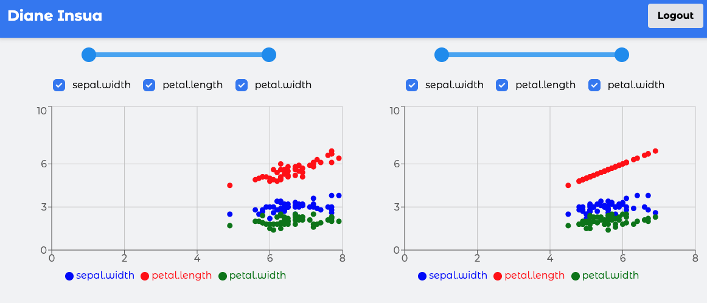

# Iris Dashboard Frontend

A modern React application for visualizing and analyzing Iris dataset data. This frontend application provides an interactive dashboard with data visualization capabilities and user authentication.

## Screenshot



## Prerequisites

- Node.js (v16 or higher)
- npm or yarn

## Getting Started

1. Clone the repository:

```bash
git clone <repository-url>
cd frontend-react
```

2. Install dependencies:

```bash
npm install
```

3. Create a `.env` file in the root directory:

```env
VITE_API_URL=http://localhost:3000
```

4. Start the development server:

```bash
npm run dev
```

The application will be available at `http://localhost:5173`

### Availables accounts

For testing purposes, you can use the following accounts:

| Email                           | Password  | Role           |
| ------------------------------- | --------- | -------------- |
| diane-insua-virginica@gmail.com | Test12345 | virginica-user |
| diane-insua-setosa@gmail.com    | Test12345 | setosa-user    |
| diane-insua-admin@gmail.com     | Test12345 | admin          |
